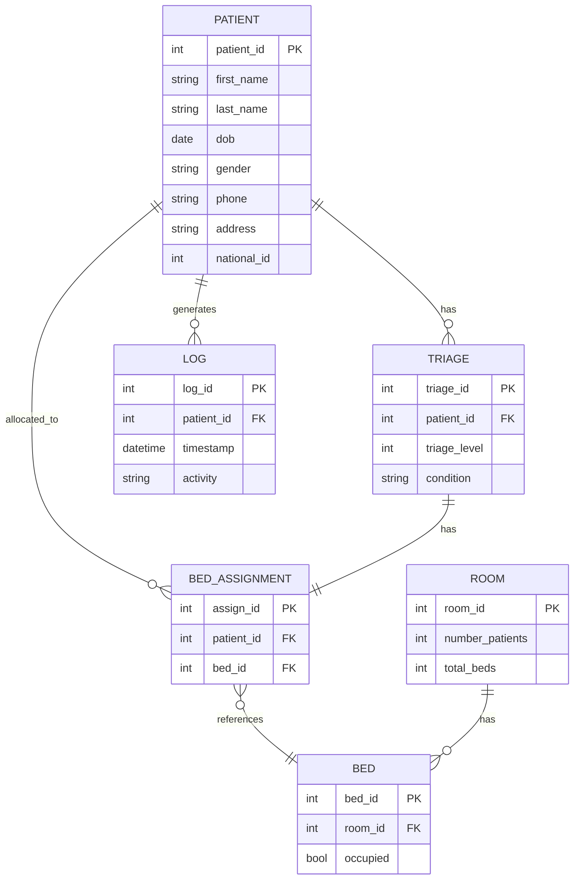

# Week 1 Focused Deliverables — St. Joseph's Hospital CLI System

This version focuses **only** on the core functional areas required: patient registration, priority treatment, and bed assignment — demonstrating **hash tables**, **priority queues**, **trees**, and **linked lists** using a command-line, text-based program.

---

## 1. System Overview
The **Hospital Management CLI System** simulates patient management in a hospital, specifically handling:
- **Patient registration** (using a hash table for quick lookup)
- **Priority treatment queue** (using a priority queue for emergencies)
- **Bed/room allocation** (using a binary tree for efficient room assignment)
- **Patient logs/history** (using linked lists for chronological tracking)

All data is stored in **text files**, ensuring persistence between runs.

---

## 2. ER Diagram (Updated)


---

## 3. Data Structures & Their Roles
| Feature | Data Structure | Description |
|----------|----------------|--------------|
| **Patient Registration** | Hash Table | Quick access to patient data by ID or national ID |
| **Emergency Triage Queue** | Priority Queue | Prioritize critical patients by triage level (lower number = higher priority) |
| **Bed Allocation** | Binary Tree | Assign and release beds efficiently based on room hierarchy or availability |
| **Patient Logs** | Linked List | Maintain chronological logs of treatments, admissions, and discharges |

---

## 4. Updated File Design

| File Name | Description | Example Fields |
|------------|--------------|----------------|
| **patients.txt** | Stores all registered patient details | `patient_id|first_name|last_name|dob|gender|phone|address|national_id` |
| **triage.txt** | Maintains all emergency/priority cases in the queue | `triage_id|patient_id|triage_level|condition` |
| **rooms.txt** | Stores details of each hospital room and bed capacity | `room_id|number_patients|total_beds` |
| **beds.txt** | Lists all hospital beds and their occupancy | `bed_id|room_id|occupied` |
| **bed_assignments.txt** | Records which bed is assigned to which patient | `assign_id|patient_id|bed_id` |
| **patient_logs.txt** | Logs actions or events linked to a patient | `log_id|patient_id|timestamp|activity` |

### Example Contents:

**patients.txt**
```
1|John|Doe|1995-06-12|M|+266-5551234|Maseru|10001
2|Mary|Molefe|1988-09-20|F|+266-5556789|Mafeteng|10002
```

**triage.txt**
```
1|1|1|Accident Trauma
2|2|3|High Fever
```

**rooms.txt**
```
1|2|4
2|1|2
```

**beds.txt**
```
1|1|false
2|1|true
3|2|false
```

**bed_assignments.txt**
```
1|1|2
2|2|3
```

**patient_logs.txt**
```
1|1|2025-10-18 10:00|Registered new patient
2|1|2025-10-18 11:00|Assigned to bed 2
3|2|2025-10-18 12:00|Added to triage queue
```

---

## 5. Key Pseudocode

### Register Patient (Hash Table)
```
Function RegisterPatient():
    Input: name, gender, dob, phone, address, national_id
    id = generatePatientID()
    record = {id, name, gender, dob, phone, address, national_id}

    AppendToFile("patients.txt", record)

    key = hash(id)
    PatientHashTable[key] = record

    Print "Patient successfully registered."
```

---

### Add Emergency Case (Priority Queue)
```
Function AddEmergencyCase():
    Input: patient_id, triage_level, condition
    arrival_time = getCurrentTime()

    entry = (triage_level, arrival_time, patient_id, condition)
    PriorityQueue.insert(entry)

    AppendToFile("triage.txt", entry)
    Print "Emergency case added to priority queue."
```

---

### Assign Bed (Binary Tree)
```
Function AssignBed(patient_id):
    node = BedTree.root

    while node is not null:
        if node.bed_status == false:
            node.bed_status = true
            node.patient_id = patient_id
            UpdateFile("beds.txt", node)
            AppendToLog(patient_id, "Assigned to bed " + node.bed_id)
            Print "Bed assigned successfully."
            return
        else:
            if node.left != null:
                node = node.left
            else:
                node = node.right

    Print "No available beds found."
```

---

### Maintain Patient Logs (Linked List)
```
Structure LogNode:
    int log_id
    int patient_id
    string message
    datetime timestamp
    LogNode* next

Function AppendToLog(patient_id, message):
    newNode = new LogNode(generateLogID(), patient_id, message, getCurrentTime())
    if PatientLogHead == null:
        PatientLogHead = newNode
    else:
        current = PatientLogHead
        while current.next != null:
            current = current.next
        current.next = newNode

    AppendToFile("patient_logs.txt", newNode)
```

---

## 6. Menu Example (CLI)
```
====== ST. JOSEPH’S HOSPITAL CLI ======
1. Register Patient
2. Add Emergency Case
3. Assign Bed
4. View Patient Logs
5. Exit
Enter your choice: _
```

---

## 7. Next Steps
- Implement **hash table**, **priority queue**, **binary tree**, and **linked list** in C++.
- Create **File I/O handlers** to load/save data from text files.
- Build a **menu-driven interface** to call these core functions.

---

*End of Week 1 — Focused on Hash Table, Priority Queue, Tree, and Linked List Integration with Updated File Design.*

